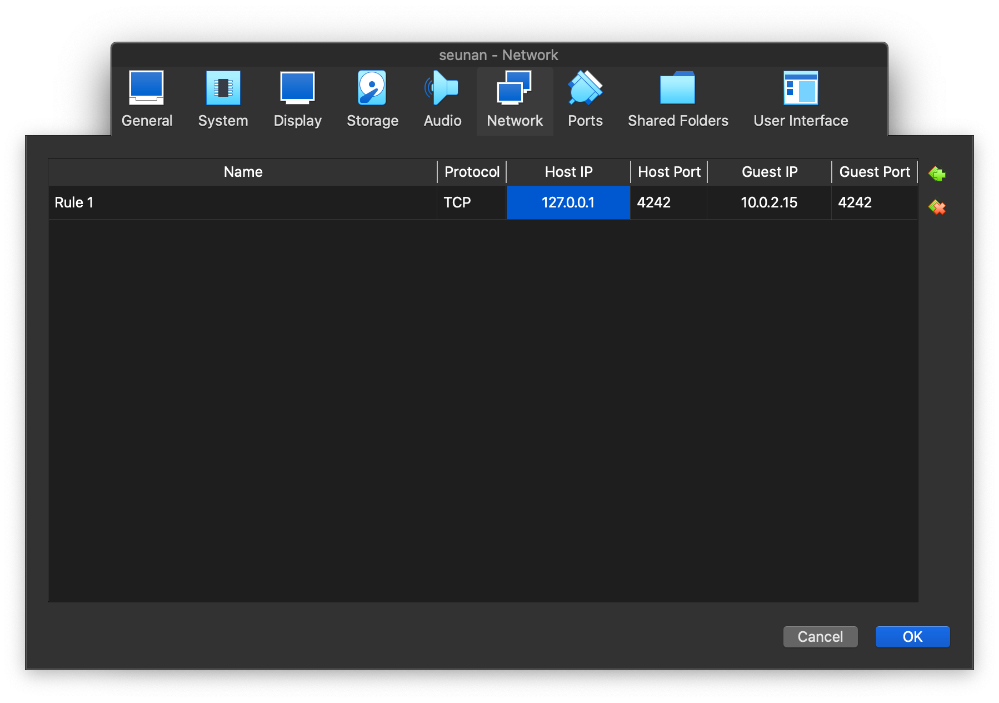
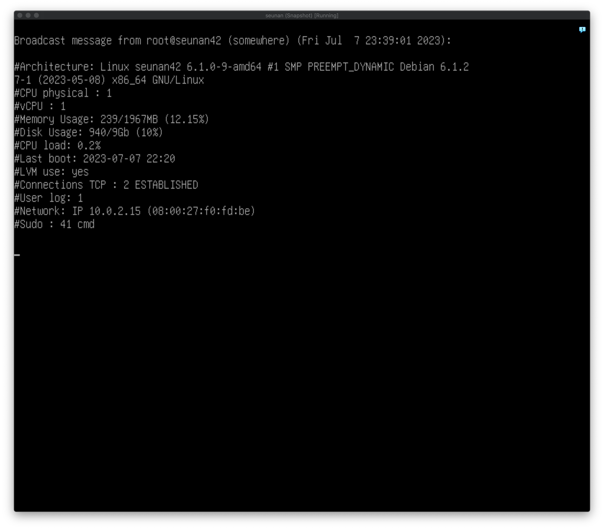

# Born2BeRoot
<!--
해야할 일
1. *apt edit-sources (== /etc/apt/sources.list)* 이 무엇인지 추가
2. 미흡한 부분 추가
3. 추가한 스샷 넣어주기
-->
- [Install Guide](#install-guide)
- [Hard Disk](#hard-disk)
	- [Partition](#partition)
	- [LVM](#lvm)
- [Package Manager](#package-manager)
	- [What Are Package Dependencies](#what-are-package-dependencies)
	- [apt vs aptitude](#apt-vs-aptitude)
- [port](#port)
- [AppArmor](#apparmor)
- [UFW](#ufw)
	- [iptables](#iptables)
- [SSH](#ssh)
	- [telnet](#telnet)
- [PASSWORD POLICY](#password-policy)
- [GROUP, USER](#group-user)
- [SUDO](#sudo)
- [monitoring.sh](#monitoringsh)
	- [crontab](#crontab)
	- [SHELL](#shell)
	- [SHA](#sha)
- [추가로 공부해야하는 부분](#추가로-공부해야하는-부분)

## Install Guide


*/boot(sda1) 파티션을 500mib로 만드는 법은 아직도 모르겠다.*


## Hard Disk
하드디스크는 물리적 저장 장치다.
- [하드디스크 구조 매우 쉽게!](https://mamu2830.blogspot.com/2019/10/blog-post_14.html)
- [파일시스템이란 매우 자세히!](https://mamu2830.blogspot.com/2019/10/chs-lba.html)

### Partition
파티션이란 하나의 하드디스크 안에서 디스크 공간을 논리적으로 나눈 것을 의미한다.
- [리눅스 마운트란 자세히!!](https://mamu2830.blogspot.com/2019/11/fdisk-df-etcfstab-blkid.html)
- [리눅스 상위 디렉토리](https://mamu2830.blogspot.com/2019/08/meaning-of-directories-on-linux.html)

### LVM
LVM은 파티션의 상위호환이라고 생각하면 쉽다.
1. 여러개의 디스크 공간을 합쳐서 하나처럼 사용
2. 사용하기 애매한 공간의 디스크 파티션(짜투리)들을 활용
3. 리눅스는 서버용으로 주로 쓰이기 때문에 저장장치의 확장이 용이해야한다.<br>
파티션만을 쓴다면 하나의 디스크를 백업하고 이를 더 큰 용량의 디스크로 교체하기 때문에 비용이 크다.<br>
LVM을 활용하면 1번 항목의 이점으로 인해 확장이 쉬워진다.

- [lvm 이란 매우 쉽게!](https://mamu2830.blogspot.com/2019/12/lvmpv-vg-lv-pe-lvm.html)
- [LVM (Logical Volume Manager) 관리](https://access.redhat.com/documentation/ko-kr/red_hat_enterprise_linux/6/html-single/logical_volume_manager_administration/index#LVM_components)

## Package Manager

**Package Management**란 새로운 소프트웨어를 설치, 업데이트, 삭제하는 일을 말한다.<br>
소프트웨어는 소스코드의 형태로 배포되는 경우와 바이너리 패키지 형태로 배포되는 경우가 있는데,<br>
소스코드의 경우 보통 하나의 아카이브 파일(tar)로 묶은 후 압축하여 배포한다.<br>
바이너리 패키지에는 응용 프로그램, 라이브러리 파일, 버전 정보나 의존성 등의 메타 정보 파일 등이 포함된다.<br>
패키지는 저장소(repository)에 저장되어 있으며, HTTP 혹은 FTP 서버를 통해 다운로드 할 수 있다.<br>
리눅스 배포판에 따라서 서로 다른 패키지 형식을 지원하는데 대부분 다음의 3가지 중 하나를 지원한다.<br>

- Debian 계열 (Debian, Ubuntu 등) : .deb 파일
- RedHat 계열 (RedHat, Fedora, CentOS) : .rpm 파일
- openSUSE 계열 : openSUSE를 위해 특별히 빌드된 .rpm 파일


*Debian에서는 /var/cache/apt/archives 디렉터리에 다양한 .deb 파일들이 보관되어 있다.*

*apt 저장소(repository)*

이러한 패키지를 관리하기 위해선 패키지 관리 도구를 사용하는데, 일반적으로 다음 두 유형의 패키지 관리 도구가 사용된다.

- 저수준 툴(low-level tools) : 실제 패키지의 설치, 업데이트, 삭제 등을 수행
- 고수준 툴(high-level toos) : 의존성의 해결, 패키지 검색 등의 기능을 제공

아래 표는 리눅스 배포판 별로 저수준/고수준 패키지 관리 도구를 나타내었다.

|DISTRIBUTION|LOW-LEVEL TOOL|HIGH-LEVEL TOOL|
|---|---|---|
|Debian and derivatives|dpkg|apt-get / aptitude|
|CentOS|rpm|yum|
|openSUSE|rmp|zypper|

- [리눅스(Linux) 패키지 관리하기](https://gamsungcoding.tistory.com/entry/Linux-%EB%A6%AC%EB%88%85%EC%8A%A4Linux-%ED%8C%A8%ED%82%A4%EC%A7%80-%EA%B4%80%EB%A6%AC%ED%95%98%EA%B8%B0)
- [(참고)리눅스 rpm 매우 자세히!](https://mamu2830.blogspot.com/2020/01/rpm-rpm.html)
- [(참고)yum 자세히!](https://mamu2830.blogspot.com/2020/02/yum.html)

### What Are Package Dependencies

하나의 패키지가 다른 패키지나 공유 라이브러리 등을 필요로 하는 관계를 패키지 간의
**의존성 dependency**라고 부른다.<br>
의존성을 해결하는 기능을 제공하는 것이 리눅스의 패키지 관리 시스템의 주요 역할이다.<br>

- [ Dependencies from package managers](https://www.gnu.org/software/gnuastro/manual/html_node/Dependencies-from-package-managers.html)
- [What Are Package Dependencies on Linux?](https://www.makeuseof.com/what-are-package-dependencies-linux/)
### apt vs aptitude

- dpkg
	- Debian 기반의 리눅스에서 사용되는 저수준 패키지 관리자(low-level package manager)
	- .deb 패키지의 설치와 삭제를 담당
	- 하지만 자동으로 패키지를 다운로드하거나 의존성을 해결해주지는 않음
- apt-get / apt-cache / apt
	- Debian 기반의 리눅스에서 사용되는 고수준 패키지 관리자(high-level package manager)
	- 패키지를 검색, 다운로드, 설치, 의존성 해결
	- 최근의 Debian 기반의 리눅스 배포판에는 apt-get과 apt-cache 의 기능을 통합한 apt 명령이 설치되어 있다
- aptitude
	- Ubuntu 기반의 리눅스의 또 다른 high-level package manager
	- apt-get 보다 좀 더 개선된 기능을 제공 (기본 텍스트 전용 대화형 인터페이스, why 명령 제공, 사용하지 않는 패키지 자동 제거 등)

```bash
/etc/apt/sources.list # == apt edit-sources, apt-get / apt-cache의 경우 패키지 repository 경로
apt list --installaed # apt로 설치한 package list
```

- [What is APT and Aptitude](https://www.tecmint.com/difference-between-apt-and-aptitude/)

## port
- [What is a port?](https://www.cloudflare.com/learning/network-layer/what-is-a-computer-port/)
- [Port (computer networking)](https://en.wikipedia.org/wiki/Port_(computer_networking))
- [Port란 무엇인가](https://study-recording.tistory.com/13)

## AppArmor

*aa-status (==apparmor_status)*<br>

Application Armor, 애플리케이션을 보호하는 리눅스 커널 보안 모듈<br>
시스템 관리자가 프로그램 프로필 별로 프로그램의 역량을 제한할 수 있게 해주는 리눅스 커널 보안 모듈이다.<br>
프로필들은 네트워크 액세스, raw 소켓 액세스 그리고 파일의 읽기, 쓰기, 실행 같은 능력을 허용할 수 있으며 /etc/apparmor.d에서 확인할 수 있다.<br>
AppArmor는 [강제적 접근 통제(MAC)](https://en.wikipedia.org/wiki/Mandatory_access_control)를 제공함으로써 전통적인 유닉스 [임의적 접근 통제(DAC)](https://en.wikipedia.org/wiki/Discretionary_access_control) 모델을 지원한다.

- [AppArmor wiki](https://en.wikipedia.org/wiki/AppArmor)
- [AppArmor](https://malwareanalysis.tistory.com/250)

## UFW
Uncomplicated FireWall, iptables의 프런트엔드이며 특히 호스트 기반 방화벽에 적합하다.
```bash
apt-get install ufw # ufw 설치
ufw enable # ufw 활성화
ufw default deny incoming # 들어오는 접속을 거부하는 기본값 설정
ufw default allow outgoing # 나가는 것을 허용하는 기본값 설정
ufw allow 4242 # 4242 포트 열기
# ----------참고--------------
ufw status verbose # 방화벽이 활성화 여부, 열린 포트 확인
ufw status numbered # 규칙의 목록과 인덱스를 함께 표시
ufw delete <rule number> # 번호를 사용하여 특정 규칙을 삭제
ufw delete allow 4242 # 4242 포트 여는 규칙 삭제
cat /etc/ufw/user.rules # ufw default rules 조회
```


- [Debian 9에서 UFW로 firewall 설정하는 방법](https://m.blog.naver.com/PostView.naver?isHttpsRedirect=true&blogId=jodi999&logNo=221409997866)
- [우분투(Ubuntu) 환경에 방화벽(UFW) 설정하기](https://lindarex.github.io/ubuntu/ubuntu-ufw-setting/)
- [UFW Status](https://linuxhint.com/ufw_status/)
- [Uncomplicated Firewall (ufw)](https://wiki.debian.org/Uncomplicated%20Firewall%20%28ufw%29)

### iptables
iptables 명령어로 커널상에서의 netfilter 패킷필터링 기능을 사용자 공간에서 제어할 수 있다.
- [iptables](https://en.wikipedia.org/wiki/Iptables)
- [iptables 개념 및 명령어](https://linuxstory1.tistory.com/entry/iptables-%EA%B8%B0%EB%B3%B8-%EB%AA%85%EB%A0%B9%EC%96%B4-%EB%B0%8F-%EC%98%B5%EC%85%98-%EB%AA%85%EB%A0%B9%EC%96%B4)

## SSH
```bash
apt-get install openssh-server
vi /etc/ssh/sshd_config # ssh 데몬의 작업을 수정하는 옵션을 설정할 수 있는 OpenSSH용 시스템 전체 구성 파일
	Port 4242 # ssh 데몬이 들어오는 연결을 수신 대기하는 포트 번호를 지정
	PermitRootLogin no # root가 ssh를 사용하여 로그인할 수 있는지 여부를 지정
cat /etc/hostname # = hostname
hostname -I # VM에서 할당받은 IP를 확인
 hostnamectl set-hostname <hostname> # hostname 변경
systemctl restart ssh # SSH 데몬 재시작
systemctl status ssh # SSH 데몬 상태 확인
ssh seunan@<macIP> -p <host port> # host port에 연결
```


*ssh 연결포트를 4242, 루트로 ssh 연결이 안되게 PermitRootLogin을 No*


*en0의 ip를 적어주면 된다. [(en0과 en1의 차이)](https://stackoverflow.com/questions/29958143/what-are-en0-en1-p2p-and-so-on-that-are-displayed-after-executing-ifconfig)*

*자신(host)의 IP주소인 루프백 주소([127.0.0.1](https://en.wikipedia.org/wiki/Localhost) )로 써도 된다.*

User log는 접속해있는 유저의 수를 말한다. (1)


*ssh seunan@127.0.0.1 -p 4242
를 통해 4242 포트로 연결*

User log가 2로 증가한 것을 볼 수 있다.

- [Remote Login with SSH](https://avocado89.medium.com/remote-login-with-ssh-dbb804f82ebf)
- [Debian에서 원격 로그인을 위한 SSH 서버 활성화](https://m.blog.naver.com/PostView.naver?isHttpsRedirect=true&blogId=jodi999&logNo=221334854192)
- [Configure the /etc/ssh/sshd_config file](https://www.linuxtopia.org/online_books/linux_system_administration/securing_and_optimizing_linux/chap15sec122.html)
- [Change the Default SSH port](https://www.ionos.com/help/server-cloud-infrastructure/getting-started/important-security-information-for-your-server/changing-the-default-ssh-port/)
- [Find Local IP Address](https://www.avg.com/en/signal/find-ip-address)
- [VirtualBox lab: Port Forwarding](https://nsrc.org/workshops/2014/sanog23-virtualization/raw-attachment/wiki/Agenda/ex-virtualbox-portforward-ssh.htm)
- [VirtualBox NAT port forwarding](https://www.nemonein.xyz/2020/01/3048/)

### telnet
- [Introduction to TELNET](https://www.geeksforgeeks.org/introduction-to-telnet/)

## PASSWORD POLICY
```bash
vi /etc/login.defs
PASS_MAX_DAYS 30
PASS_MIN_DATS 2
PASS_WARN_AGE 7

chage -l <username> # user 암호 정책 확인
chage -M 30 # : 최대 사용가능일
chage -m 2 # : 최소 의무사용일
chage -W 7 # : 만료 전 경고일
passwd -e <username> # user 비밀번호 변경

apt-get install libpam-pwquality # pwquality 라이브러리 설치
vi /etc/pam.d/common-password
retry=3 minlen=10 ucredit=-1 lcredit=-1 dcredit=-1 maxrepeat=3 reject_username enforce_for_root difok=7 # root는 password에 대한 캐시를 저장하지 않기 때문에 difok 설정이 안먹음

passwd # password 변경
```


- [shell - 패스워드 생성 법칙 적용](https://techpicnic.tistory.com/506)
- [Linux 패스워드 관련 정책 설정](https://www.haedongg.net/2020/08/28/linux-%ED%8C%A8%EC%8A%A4%EC%9B%8C%EB%93%9C-%EA%B4%80%EB%A0%A8-%EC%A0%95%EC%B1%85-%EC%84%A4%EC%A0%95/)
- [man pam_pwquality](https://manpages.debian.org/stretch/libpam-pwquality/pam_pwquality.8.en.html)
- [Managing Password Complexity in Linux](https://www.baeldung.com/linux/password-complexity)

## GROUP, USER
```bash
id <username> # == groups, user의 groups 확인
cat /etc/group # 그룹 목록
cat /etc/passwd # 사용자 목록
groupadd <groupname> # 그룹 생성
groupdel <groupname> # 그룹 삭제
gpasswd -a <username> <groupname> # user를 group에 추가
gpasswd -d <username> <groupname> # user를 group에서 삭제
groupmod -n group2 group1 # group1을 group2로 변경

su <username> # 사용자 변경
adduser # 유저 생성(비밀번호, 홈 디렉토리 등 자동 설정)
userdel # 유저 삭제
# ----------참고--------------
useradd # 유저 생성(수동)
	-m # 사용자 홈 디렉토리도 함께 생성
	-g # 그룹 지정
	-d # 디렉토리 지정
	-s # 쉘 지정
	-p # 패스워드 지정
```
- [useradd, usermod, /etc/passwd , /etc/shadow 자세히!](https://mamu2830.blogspot.com/2019/08/etcpasswd-etcshadow.html)
- [groupadd , gpasswd , id , groupmod 매우 자세히 설명!](https://mamu2830.blogspot.com/2019/08/linux-group-groupadd-gpasswd-id-groupmod.html)
- [리눅스 사용자 목록 확인](https://overcode.tistory.com/entry/%EB%A6%AC%EB%88%85%EC%8A%A4-%EC%82%AC%EC%9A%A9%EC%9E%90-%EB%AA%A9%EB%A1%9D-%ED%99%95%EC%9D%B8-Linux-User-List)
- [chown, chgrp 매우 자세히!](https://mamu2830.blogspot.com/2019/08/chown-chgrp.html)
- [리눅스 rwx, chmod, 8진수 매우 자세히!](https://mamu2830.blogspot.com/2019/09/rwx.html)
- [setuid setgid 매우 자세하게!](https://mamu2830.blogspot.com/2019/10/setuid-setgid-sticky-bit.html)

## SUDO
```bash
apt-get install sudo
visudo /etc/sudoers
	Defaults	secure_path="/usr/local/sbin:/usr/local/bin:/usr/sbin:/usr/bin:/sbin:/bin:/snap/bin" # sudo는 사용자의 PATH 환경 변수 대신 이 값을 사용
	Defaults	passwd_tries=3 # 비밀번호 재시도 횟수
	Defaults	badpass_message="incorrect password" # 잘못된 비밀번호를 입력할 경우 표시되는 메시지
	Defaults	authfail_message="fail to authenticate" # 사용자가 인증(이름 혹은 암호)에 실패한 후 표시되는 메시지
	Defaults	log_input, log_output # sudo는 터미널에서 명령을 실행하고 모든 사용자 입력과 화면으로 전송되는 모든 출력을 로그로 기록
	Defaults	iolog_dir="/var/log/sudo/" # log_input 또는 log_output 옵션이 활성화 되어있을 경우 입출력 로그 디렉터리의 경로 이름
	Defaults	requiretty # tty를 할당 받지 않은 shell에서는 sudo 를 사용하지 못하게 하는 옵션
mkdir /var/log/sudo
usermod -aG sudo <username> # user에게 sudo 그룹 권한
```


*원격으로 sudo 명령어가 실행되지 않는 것을 확인할 수 있다.*
- [sudo](https://wiki.debian.org/sudo/)
- [sudoers](https://manpages.debian.org/bookworm/sudo-ldap/sudoers.5.en.html)
- [How does sudo really work?](https://unix.stackexchange.com/questions/126914/how-does-sudo-really-work)
- [Linux에서 sudo를 설정하기 위한 10가지 유용한 Sudoers 구성](https://ko.linux-console.net/?p=1985#gsc.tab=0)
- [TTY와 PTS의 차이](https://m.blog.naver.com/PostView.naver?isHttpsRedirect=true&blogId=jangpro1003&logNo=90098910350)
- [Why would I want to require a tty for sudo? What's the security benefit of requiring it?](https://stackoverflow.com/questions/67985925/why-would-i-want-to-require-a-tty-for-sudo-whats-the-security-benefit-of-requi)
- [Linux environment: 환경변수](https://seulcode.tistory.com/546)
- [Sudo 명령의 Secure Path](https://www.tuwlab.com/ece/24044)

## monitoring.sh


권한을 안주면 실행이 안된다.

- [The architecture of your operating system and its kernel version](https://www.cyberciti.biz/faq/find-print-linux-unix-kernel-version/)
- [The number of physical processors](https://xyunsikx.tistory.com/entry/%EB%A6%AC%EB%88%85%EC%8A%A4-cpu-%EC%A0%95%EB%B3%B4-%EC%A0%95%ED%99%95%ED%95%98%EA%B2%8C-%ED%99%95%EC%9D%B8%ED%95%98%EC%9E%90)
	- [중복된 내용을 제거하는 linux uniq 명령어 사용법](https://www.lesstif.com/lpt/linux-uniq-95879394.html)
- [The number of virtual processors](https://webhostinggeeks.com/howto/how-to-display-the-number-of-processors-vcpu-on-linux-vps/)
	- [What is Virtual Processor or vCPU?](https://www.accuwebhosting.com/blog/what-is-virtual-processor-or-vcpu/)
- [The current available RAM on your server and its utilization rate as a percentage](https://www.2daygeek.com/linux-check-cpu-memory-swap-utilization-percentage/)
- [The current available memory on your server and its utilization rate as a percentage](https://www.cyberciti.biz/faq/linux-check-disk-space-command/)
- [The current utilization rate of your processors as a percentage](https://stackoverflow.com/questions/9229333/how-to-get-overall-cpu-usage-e-g-57-on-linux)
- [The date and time of the last reboot](https://www.cyberciti.biz/tips/linux-last-reboot-time-and-date-find-out.html)
- [Whether LVM is active or not](https://askubuntu.com/questions/202613/how-do-i-check-whether-i-am-using-lvm)
- [The number of active connections](https://serverfault.com/questions/421310/check-the-number-of-active-connections-on-port-80)
	- ss -at | grep ESTAB 이래요
- [The number of users using the server](https://www.computerhope.com/issues/ch001649.htm)
- [The IPv4 address of your server and its MAC (Media Access Control) address](https://www.baeldung.com/linux/get-mac-address)
- [The number of commands executed with the sudo program](https://unix.stackexchange.com/questions/167935/details-about-sudo-commands-executed-by-all-user)
	- [journalctl 사용법](https://sysops.tistory.com/115)

### crontab

```bash
crontab -e
vi /etc/crontab # crontab 사용법
systemctl cron start
systemctl cron stop # crontab 중지
systemctl cron disable # crontab 정지
systemctl cron status

* * * * * {실행 명령} or /1 * * * * {실행 명령} # 매 분마다 실행

0 13 * * * {실행 명령} # 매일 오후 13시 정각에 실행
0 0 * * 1 {실행 명령} # 매주 월요일 자정에 실행
0 0 5 * * {실행 명령} # 매달 5일 자정에 실행
25,55 * * * * {실행 명령} # 매시 25분, 55분에 실행
*/15 * * * * {실행 명령} # 15분마다 실행
0 3 * * * {실행 명령} # 매일 3시에 실행
30 */6 * * * {실행 명령} # 매 6시간마다(00:30, 06:30, 12:30, 18:30) 실행
0 6 * * 1-6 {실행 명령} # 평일(월요일~토요일) 06:00에 실행
0 7 * * 6 {실행 명령} # 토요일 07:00에 실행
```

- [크론 (Cron) 크론탭(Crontab) 사용법](https://asufi.tistory.com/entry/Linux-%ED%81%AC%EB%A1%A0-Cron-%ED%81%AC%EB%A1%A0%ED%83%ADCrontab-%EC%82%AC%EC%9A%A9%EB%B2%95)
- [Wall command in Linux](https://linuxize.com/post/wall-command-in-linux/)

### SHA
- [what is sha?](https://ko.wikipedia.org/wiki/SHA)
- [shasum](https://linuxhint.com/shasum-linux/)

### SHELL
- [shell if](https://serverfault.com/questions/50585/whats-the-best-way-to-check-if-a-volume-is-mounted-in-a-bash-script)
- [shell printf](https://phoenixnap.com/kb/bash-printf)
- [shell awk](https://recipes4dev.tistory.com/171#recentEntries)
