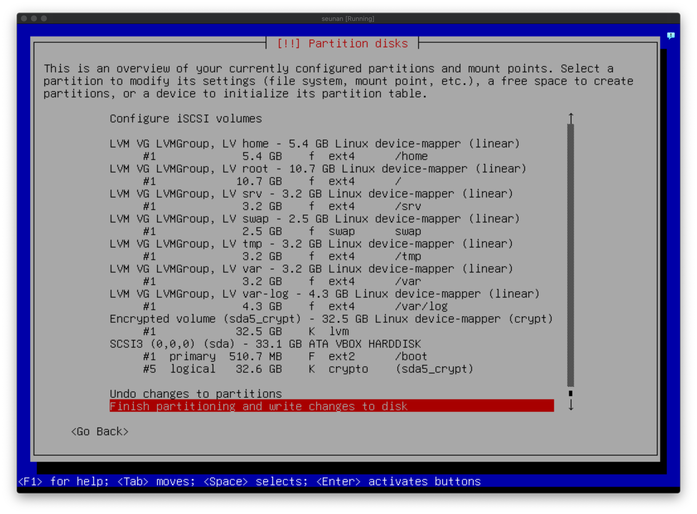

# Born2BeRoot

## Install Guide

## LVM이란
- [1](https://mamu2830.blogspot.com/2019/12/lvmpv-vg-lv-pe-lvm.html)
- [2](https://wiseworld.tistory.com/32)

## apt와 aptitude
- [1](https://www.tecmint.com/difference-between-apt-and-aptitude/)

## SElinux 와 AppArmor
- [1](https://www.techtarget.com/searchdatacenter/tip/Compare-two-Linux-security-modules-SELinux-vs-AppArmor)
- [2](https://phoenixnap.com/kb/apparmor-vs-selinux)

## SSH
- [1](https://www.freecodecamp.org/news/ssh-meaning-in-linux/#:~:text=Secure%20Shell%20(SSH)%20is%20a,remote%20administration%20and%20file%20transfer.)
- [2](https://baked-corn.tistory.com/52)
- [3](https://m.blog.naver.com/PostView.naver?isHttpsRedirect=true&blogId=jodi999&logNo=221334854192)
## UFW
- [1](https://m.blog.naver.com/PostView.naver?isHttpsRedirect=true&blogId=jodi999&logNo=221409997866)
- [2](https://wiki.debian.org/Uncomplicated%20Firewall%20%28ufw%29)

## PASSWORD POLICY
- [1](https://techpicnic.tistory.com/506)
- [2](https://www.haedongg.net/2020/08/28/linux-%ED%8C%A8%EC%8A%A4%EC%9B%8C%EB%93%9C-%EA%B4%80%EB%A0%A8-%EC%A0%95%EC%B1%85-%EC%84%A4%EC%A0%95/)
- [3](https://manpages.debian.org/stretch/libpam-pwquality/pam_pwquality.8.en.html)
- [4](https://www.baeldung.com/linux/password-complexity)
- [5](https://serverfault.com/questions/1016570/how-to-enable-enforce-for-root-under-pam-pwquality-so-in-rhel8-centos-8)

## GROUP
- [1](https://www.manualfactory.net/13414)
- [2](https://goni9071.tistory.com/68)
## SUDO
- [1](https://darrengwon.tistory.com/844)
- [2](https://wiki.debian.org/sudo/)
- [3](https://ostechnix.com/how-to-change-default-sudo-log-file-in-linux/)
- [4](https://bloodguy.tistory.com/entry/Linux-ssh%EB%82%98-%EB%8B%A4%EB%A5%B8-%EB%8D%B0%EB%AA%AC%EC%97%90%EC%84%9C-sudo-u-%EB%A5%BC-%EC%9D%B4%EC%9A%A9%ED%95%B4-%EB%8B%A4%EB%A5%B8-%EC%9C%A0%EC%A0%80%EA%B6%8C%ED%95%9C%EC%9C%BC%EB%A1%9C-%EC%8B%A4%ED%96%89%EC%8B%9C-sudo-sorry-you-must-have-a-tty-to-run-sudo-%EC%98%A4%EB%A5%98-%ED%95%B4%EA%B2%B0)
- [5](https://www.cloudpanel.io/tutorial/how-to-add-user-to-sudoers-in-debian/)
- [6](https://ko.linux-console.net/?p=1985#gsc.tab=0)
