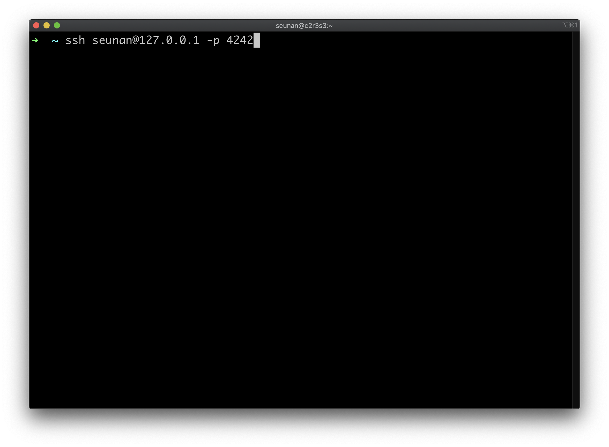

# Born2BeRoot
- [Install Guide](#install-guide)
- [LVM](#what-is-lvm)
- [apt vs aptitude](#apt-vs-aptitude)
- [SElinux vs AppArmor](#selinux-vs-apparmor)
- [SSH](#ssh)
- [UFW](#ufw)
- [PASSWORD POLICY](#password-policy)
- [GROUP](#group)
- [SUDO](#sudo)
- [monitoring.sh](#monitoringsh)

## Install Guide


## What is LVM
- [What is LVM](https://mamu2830.blogspot.com/2019/12/lvmpv-vg-lv-pe-lvm.html)
- [LVM Concepts](https://wiseworld.tistory.com/32)

## apt vs aptitude
- [What is APT and Aptitude](https://www.tecmint.com/difference-between-apt-and-aptitude/)

## SElinux vs AppArmor
- [Compare two Linux security modules: SELinux vs AppArmor](https://www.techtarget.com/searchdatacenter/tip/Compare-two-Linux-security-modules-SELinux-vs-AppArmor)
- [AppArmor vs. SELinux](https://phoenixnap.com/kb/apparmor-vs-selinux)

## UFW


```bash
apt-get install ufw # ufw 설치
ufw enable # ufw 활성화
ufw default deny incoming # 들어오는 접속을 거부하는 기본값 설정
ufw default allow outgoing # 나가는 것을 허용하는 기본값 설정
ufw allow 4242 # 4242 포트 열기
ufw status verbose # 방화벽이 활성화되어 있는지 확인
cat /etc/ufw/user.rules # ufw default rules 조회
ufw status numbered # 규칙의 번호가 매겨진 목록을 표시
ufw delete <rule number> # 번호를 사용하여 특정 규칙을 삭제
```
- [UFW setting1](https://m.blog.naver.com/PostView.naver?isHttpsRedirect=true&blogId=jodi999&logNo=221409997866)
- [UFW setting2](https://lindarex.github.io/ubuntu/ubuntu-ufw-setting/)
- [UFW status](https://linuxhint.com/ufw_status/)
- [Debian wiki](https://wiki.debian.org/Uncomplicated%20Firewall%20%28ufw%29)

## SSH




```bash
apt-get install openssh-server
vim /etc/ssh/sshd_config # ssh 데몬의 작업을 수정하는 옵션을 설정할 수 있는 OpenSSH용 시스템 전체 구성 파일
	Port 4242 # ssh 데몬이 들어오는 연결을 수신 대기하는 포트 번호를 지정
	PermitRootLogin no # root가 ssh를 사용하여 로그인할 수 있는지 여부를 지정
vim /etc/hostname # = hostname
hostname -I # VM에서 할당받은 IP를 확인
hostnamectl # hostname 변경
systemctl restart ssh # SSH 데몬 재시작
systemctl status ssh # SSH 데몬 상태 확인
ssh seunan@<macIP> -p <host port> # host port에 연결
```
- [What is SSH](https://www.freecodecamp.org/news/ssh-meaning-in-linux/#:~:text=Secure%20Shell%20(SSH)%20is%20a,remote%20administration%20and%20file%20transfer.)
- [Enable the SSH server](https://m.blog.naver.com/PostView.naver?isHttpsRedirect=true&blogId=jodi999&logNo=221334854192)
- [Configure the /etc/ssh/sshd_config file](https://www.linuxtopia.org/online_books/linux_system_administration/securing_and_optimizing_linux/chap15sec122.html)
- [SSH wiki](https://zetawiki.com/wiki/%EB%A6%AC%EB%88%85%EC%8A%A4_sshd_%EC%9E%AC%EC%8B%9C%EC%9E%91)
- [Change the Default SSH port](https://www.ionos.com/help/server-cloud-infrastructure/getting-started/important-security-information-for-your-server/changing-the-default-ssh-port/)
- [PermitRootLogin](https://veneas.tistory.com/entry/Linux-SSH-root-%EC%A0%91%EC%86%8D-%ED%97%88%EC%9A%A9-%EC%84%A4%EC%A0%95-PermitRootLogin)
- [hostnamectl](https://zetawiki.com/wiki/%EB%A6%AC%EB%88%85%EC%8A%A4_%ED%98%B8%EC%8A%A4%ED%8A%B8%EB%AA%85_%EB%B3%80%EA%B2%BD_hostnamectl_set-hostname)
- [virtualbox network setting](https://www.nakivo.com/blog/virtualbox-network-setting-guide/)
- [Find Local IP Address](https://www.avg.com/en/signal/find-ip-address)
- [Port Forwarding1](https://nsrc.org/workshops/2014/sanog23-virtualization/raw-attachment/wiki/Agenda/ex-virtualbox-portforward-ssh.htm)
- [Port Forwarding2](https://www.activecountermeasures.com/port-forwarding-with-virtualbox/)
- [Port Forwarding3](https://www.nemonein.xyz/2020/01/3048/)
- [Port Forwarding4](https://m.blog.naver.com/yexx/221996230014)


## PASSWORD POLICY


```bash
chage -l <username> # user 암호 정책 확인
chage -M 30 # : 최대 사용가능일
chage -m 2 # : 최소 의무사용일
chage -W 7 # : 만료 전 경고일
passwd -e <username> # user 비밀번호 변경

vi /etc/login.defs
PASS_MAX_DAYS 30
PASS_MIN_DATS 2
PASS_WARN_AGE 7

apt-get install libpam-pwquality # pwquality 라이브러리 설치
vi /etc/pam.d/common-password
retry=3 minlen=10 ucredit=-1 lcredit=-1 dcredit=-1 maxrepeat=3 reject_username enforce_for_root difok=7 # root는 password에 대한 캐시를 저장하지 않기 때문에 difok 설정이 안먹음

passwd -e <username> # password 변경
```
- [Password policy1](https://techpicnic.tistory.com/506)
- [Password policy2](https://www.haedongg.net/2020/08/28/linux-%ED%8C%A8%EC%8A%A4%EC%9B%8C%EB%93%9C-%EA%B4%80%EB%A0%A8-%EC%A0%95%EC%B1%85-%EC%84%A4%EC%A0%95/)
- [man PAM_PWQUALITY](https://manpages.debian.org/stretch/libpam-pwquality/pam_pwquality.8.en.html)
- [Managing Password Complexity in Linux](https://www.baeldung.com/linux/password-complexity)
## GROUP
- [group](https://www.manualfactory.net/13414)
- [Verify user groups](https://goni9071.tistory.com/68)
## SUDO


```bash
apt-get install sudo
visudo /etc/sudoers
	Defaults	secure_path="/usr/local/sbin:/usr/local/bin:/usr/sbin:/usr/bin:/sbin:/bin:/snap/bin" # sudo는 사용자의 PATH 환경 변수 대신 이 값을 사용
	Defaults	passwd_tries=3 # 비밀번호 재시도 횟수
	Defaults	badpass_message="incorrect password" # 잘못된 비밀번호를 입력할 경우 표시되는 메시지
	Defaults	authfail_message="fail to authenticate" # 사용자가 인증(이름 혹은 암호)에 실패한 후 표시되는 메시지
	Defaults	log_input, log_output # sudo는 터미널에서 명령을 실행하고 모든 사용자 입력과 화면으로 전송되는 모든 출력을 로그로 기록
	Defaults	iolog_dir="/var/log/sudo/" # log_input 또는 log_output 옵션이 활성화 되어있을 경우 입출력 로그 디렉터리의 경로 이름
	Defaults	requiretty # tty를 할당 받지 않은 shell에서는 sudo 를 사용하지 못하게 하는 옵션
mkdir /var/log/sudo
usermod -aG sudo <username> # user에게 sudo 그룹 권한
```
- [debian wiki](https://wiki.debian.org/sudo/)
- [Add User to Sudoers](https://www.cloudpanel.io/tutorial/how-to-add-user-to-sudoers-in-debian/)
- [Configure Sudoers](https://ko.linux-console.net/?p=1985#gsc.tab=0)
- [man sudoers](https://man.freebsd.org/cgi/man.cgi?query=sudoers&apropos=0&sektion=0&manpath=FreeBSD+13.0-RELEASE+and+Ports&arch=default&format=html)
- [requiretty](https://kldp.org/node/155210)
- [what is tty](https://jake-seo-dev.tistory.com/115)

## monitoring.sh
- [The architecture of your operating system and its kernel version](https://www.cyberciti.biz/faq/find-print-linux-unix-kernel-version/)
- [The number of physical processors](https://www.cyberciti.biz/faq/check-how-many-cpus-are-there-in-linux-system/)
- [The number of virtual processors](https://webhostinggeeks.com/howto/how-to-display-the-number-of-processors-vcpu-on-linux-vps/)
- [The current available RAM on your server and its utilization rate as a percentage](https://www.2daygeek.com/linux-check-cpu-memory-swap-utilization-percentage/)
- [The current available memory on your server and its utilization rate as a percentage](https://stackoverflow.com/questions/10585978/how-to-get-the-percentage-of-memory-free-with-a-linux-command)
- [The current utilization rate of your processors as a percentage1](https://www.baeldung.com/linux/get-cpu-usage)
- [The current utilization rate of your processors as a percentage2](https://stackoverflow.com/questions/9229333/how-to-get-overall-cpu-usage-e-g-57-on-linux)
- [The date and time of the last reboot](https://www.cyberciti.biz/tips/linux-last-reboot-time-and-date-find-out.html)
- [Whether LVM is active or not](https://askubuntu.com/questions/202613/how-do-i-check-whether-i-am-using-lvm)
- [The number of active connections](https://serverfault.com/questions/421310/check-the-number-of-active-connections-on-port-80)
- [The number of users using the server](https://www.computerhope.com/issues/ch001649.htm)
- [The IPv4 address of your server and its MAC (Media Access Control) address](https://www.howtouselinux.com/post/linux-command-get-mac-address-in-linux)
- [The number of commands executed with the sudo program](https://unix.stackexchange.com/questions/167935/details-about-sudo-commands-executed-by-all-user)
