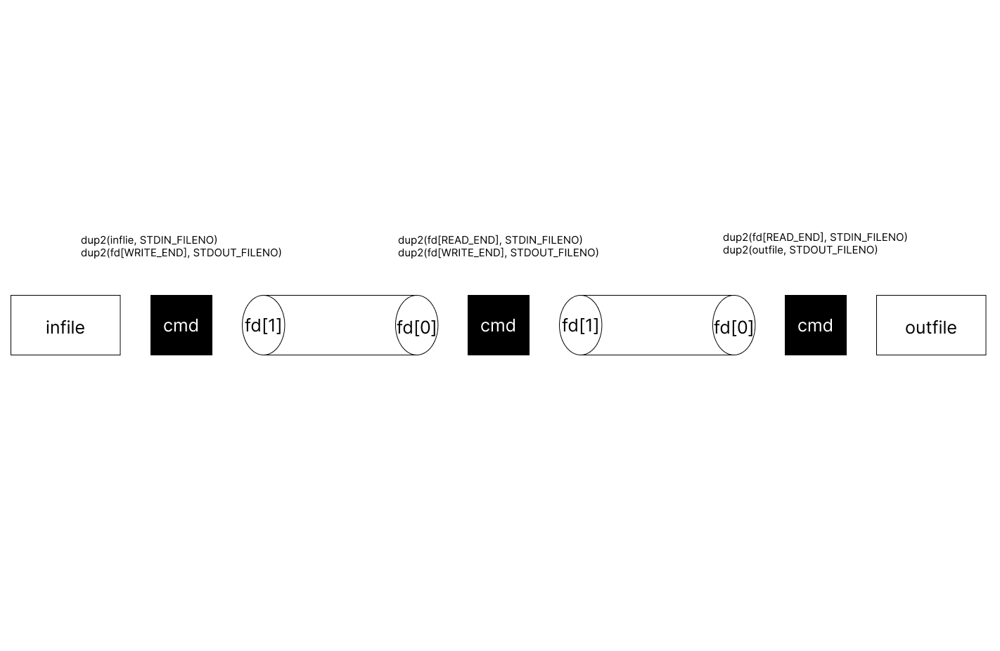

# pipex

`< infile cmd1 | cmd2 > outfile`



## Allowed functions

- [pipe](https://tldp.org/LDP/lpg/node11.html)
	 - [+](https://nomad-programmer.tistory.com/110)
- [fork](https://codetravel.tistory.com/23)
- open
- close
- [execve](https://badayak.com/entry/C%EC%96%B8%EC%96%B4-%EB%8B%A4%EB%A5%B8-%ED%94%84%EB%A1%9C%EA%B7%B8%EB%9E%A8-%EC%8B%A4%ED%96%89-%ED%95%A8%EC%88%98execve)
[+](https://www.it-note.kr/157)
- [wait](https://codetravel.tistory.com/42)
- [waitpid](https://codetravel.tistory.com/42)
- [dup](https://reakwon.tistory.com/104)
- [dup2](https://reakwon.tistory.com/104)
- [unlink](https://www.it-note.kr/177)
- [access](https://jdm.kr/blog/76)
- [perror](https://modoocode.com/53)
- [strerror](https://modoocode.com/105)


echo $PATH

```zsh
> ls a
ls: a: No such file or directory
```

ls또한 에러 메세지 앞에 프로그램의 이름을 띄우기 때문에 pipex: [file]: errmsg 형식으로 에러메세지 만들것

file이 올바르지 않은 것
- bash: [file]: Permission denied (권한이 없을 때)
- bash: [file]: No such file or directory (파일이 존재하지 않을 때)

cmd가 올바르지 않은 것
- bash: [cmd]: command not found
- 만약 파일이 안열리면 (infile의 경우에만) 오류메세지 없음 -> open err 시 exit

awk 구현하지 않음

```c
// 터지는 케이스들 모음

./pipex /dev/random "cat" "head -1" a
./pipex a ls "sleep 10" b // ps 시 좀비 프로세스가 생김
chmod 000 a
unset PATH
```
