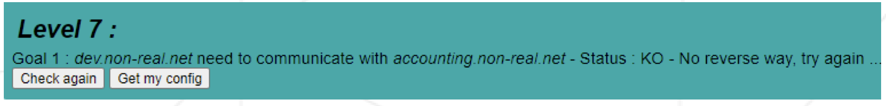

# **Net_Practice**

##### _Summary: This document is a System Administration related exercise._
Version: 2

 요약 : 이 문서는 시스템 관리와 관련된 연습 문제입니다.
버전: 2

 

# Contents

| Chapter |               Contents                | page |
| :-----: | :-----------------------------------: | :--: |
|    I    |    [**Preamble**](#Chapter-1)         |  2   |
|   II    | [**Introduction**](#Chapter-2)        |  3   |
|   III   |   [**General guidelines**](#Chapter-3)|  5   |
|   IV    | [**Mandatory part**](#Chapter-4)      |  7   |
|	 V    |[**Submission and peer-evaluation**](#Chapter-5)|  8   |

 

# **Chapter 1**

## **Preamble**

 

# **Chapter 2**

## **Introduction**

##### _This project is a general practical exercise to let you discover networking._

 이 프로젝트는 네트워킹을 알아갈수 있도록 하는 일반적인 실습입니다.

 

# **Chapter 3**

## **General guidelines**

##### _You will have to configure small-scale networks. To do so, it will be necessary to understand how **TCP/IP addressing** works._

 소규모 네트워크를 구성해야 합니다. 그러기 위해서는 **TCP/IP 주소 지정**이 어떻게 작동하는지 이해해야 합니다.

##### _You will have to complete 10 levels (i.e. 10 exercises) and turn them in your Git repository._

 10개의 레벨(즉, 10개의 연습문제)을 완료하고 Git 저장소에 제출해야 합니다.

> ℹ️  
>
> In this project, the networks you will work with are not real ones. They will be available via a training interface that you will open in your web browser. 
>
> 이 프로젝트에서 작업하게 될 네트워크는 실제 네트워크가 아닙니다. 웹 브라우저에서 열게 될 교육 인터페이스를 통해 사용할 수 있습니다.  
>

 

# **Chapter 4**

## **Mandatory part**

##### _This project is about solving networking problems to make a network run._

 이 프로젝트는 네트워킹 문제를 해결하여 네트워크가 실행되도록 만드는 것입니다.

- ##### _First, download the file attached to the project’s page._

 - 먼저 프로젝트 페이지에 첨부된 파일을 다운로드하세요.

- ##### _Then, extract the files in whatever folder you want._

 - 그런 다음 원하는 폴더에 파일을 압축 해제하세요.

- ##### _In this folder, run the index.html file._

 - 이 폴더에서 index.html 파일을 실행하세요.

- ##### _This interface should open in your web browser:_

 - 이 인터페이스는 웹 브라우저에서 열립니다.

##### _Welcome to NetPractice! :)_

 NetPractice에 오신 것을 환영합니다! :)

##### _As mentioned on the page:_

 페이지에 언급된 것처럼:

- ##### _You can practice if you input your login in the field_

 - 필드에 로그인 정보를 입력하면 연습할 수 있습니다.

- ##### _Or you can try the ’correction’ version if you leave the field empty._

 - 또는 빈 필드를 남겨두면 'correction' 버전을 시도할 수 있습니다.

##### _There are 10 levels available for training. Below is an example:_

 연습용으로 10개의 레벨이 제공됩니다. 아래는 예시입니다.

##### _For each level, a non-functioning network diagram appears._

 각 레벨마다 작동하지 않는 네트워크 다이어그램이 나타납니다.

##### _At the top of your window, you will see a goal to achieve: the issues to solve so that the network runs properly. There are two buttons you can use:_

 창의 맨 위에는 네트워크가 올바르게 작동하도록 문제를 해결하는 데 필요한 목표가 표시됩니다. 사용할 수 있는 두 가지 버튼이 있습니다.

- ##### _**Check again** to verify whether your configuration was correct or not._

- **Check again**을 눌러 구성이 올바른지 확인하세요.

- ##### _**Get my config** to download your configuration whenever you need to. It will be useful to turn in your assignment._

- **Get my config**를 눌러 필요할 때마다 구성을 다운로드하세요. 과제를 제출하는 데 유용합니다.

##### _When you have successfully completed a level, a new button will appear. Click on this button to get to the next level._

 레벨을 성공적으로 완료하면 새로운 버튼이 나타납니다. 이 버튼을 클릭하여 다음 레벨로 이동하세요.

> ⚠️  
>
> Before moving to the next level, don’t forget to export your configuration using the Get my config button so you can put it in your Git repository. 
>
> 다음 단계로 넘어가기 전에 Get my config 버튼을 사용하여 구성을 내보내서 Git 리포지토리에 저장하는 것을 잊지 마세요.  
>

##### _At the bottom of the page, you will see logs. They can be helpful to understand why your configuration is wrong._

 페이지 하단에 로그가 표시됩니다. 구성이 잘못된 이유를 이해하는 데 도움이 될 수 있습니다.

##### _Here is an example of what kind of exercise you will get:_

 연습문제의 예시입니다.

##### _To succeed, modify the unshaded fields until your network configuration is correct._

 네트워크 구성이 올바르게 될 때까지 회색이 아닌 필드를 수정하세요.

##### _To complete this assignment, it is strongly recommended to understand how address- ing works in a network in which there are devices such as routers. Read about TCP/IP addressing._

 이 과제를 완료하려면 라우터와 같은 장치가 있는 네트워크에서 주소 지정이 어떻게 작동하는지 이해하는 것이 좋습니다. TCP/IP 주소 지정에 대해 읽어보세요.

 

# **Chapter 5**

## **Submission and peer-evaluation**

##### _Turn in your assignment in your Git repository as usual. Only the work inside your repos- itory will be evaluated during the defense. Don’t hesitate to double check the names of your files to ensure they are correct._

 평소처럼 Git 저장소에 과제를 제출하세요. 방어 중에는 저장소 내의 작업만 평가됩니다. 파일 이름을 다시 한 번 확인하여 올바른지 확인하세요.

##### _Because 10 levels are available in the training interface, you will have to turn 10 files in your repository (1 file per level). Put them at the root of your repository._

 교육 인터페이스에 10개의 레벨이 있으므로 저장소에 10개의 파일을 제출해야 합니다(레벨당 1개의 파일). 저장소의 루트에 넣으세요.

##### _Don’t forget to enter your login in the training interface. Export a file per level using the Get my config button._

 교육 인터페이스에 로그인을 입력하는 것을 잊지 마세요. Get my config 버튼을 사용하여 레벨당 파일을 내보내세요.

> ⚠️  
>
> It is very important that you enter your login in the interface. 
>
> 인터페이스에 로그인을 입력하는 것이 매우 중요합니다.  
>

##### _During defense, you will have to succeed 3 random levels as mentionned on the training platform. Of course, you will have a limited time to do so._

 평가 중에는 교육 플랫폼에 언급된 대로 3개의 무작위 레벨을 성공해야 합니다. 물론 제한된 시간이 주어집니다.

> ⚠️  
>
> You are not allowed to use external tools during your evaluation. The use of a simple calculator such as "bc" is tolerated but it will be the limit. 
>
> 평가 중에는 외부 도구를 사용할 수 없습니다. "basic caculator"와 같은 간단한 계산기를 사용하는 것은 허용되지만 한계가 될 것입니다.  
>
