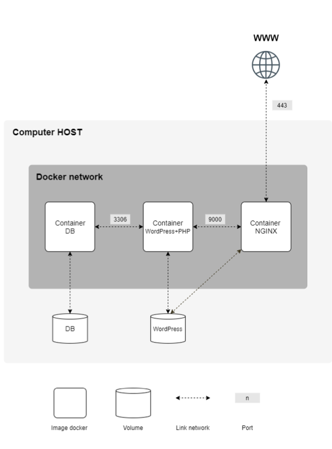
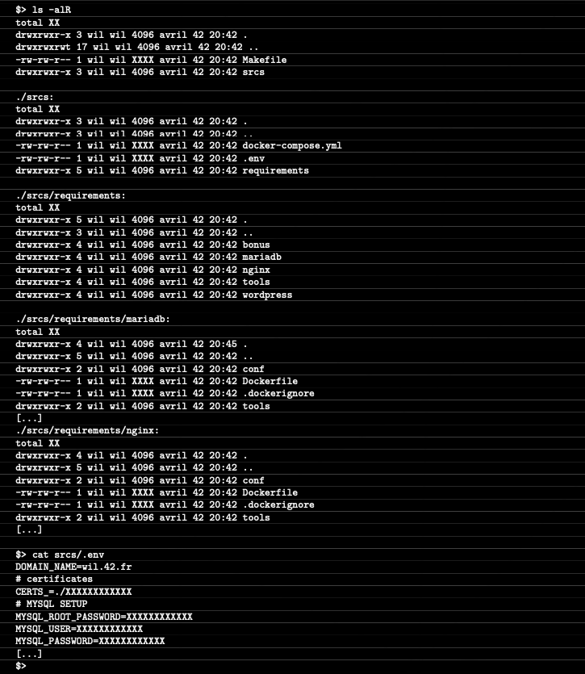

# **Inception**

##### _Summary: This document is a System Administration related exercise._

 요약: 이 문서는 시스템 관리 관련 실습입니다.

##### _Version: 2.1_

 버전: 2.1

# **Contents**

| Chapter | Contents                                         | page |
| :-----: | :----------------------------------------------- | :--: |
|    1    | [**Preamble**](#chapter-1)                       |  2   |
|    2    | [**Introduction**](chapter-2)      	             |  3   |
|    3    | [**General guidelines**](#chapter-3)             |  4   |
|    4    | [**Mandatory part**](#chapter-4)                 |  4   |
|    5    | [**Bonus part**](#chapter-5)                     |  9   |
|    6    | [**Submission and peer-evaluation**](#chapter-6) |  10  |

 

# **Chapter 1**

## **Preamble**

##### _One container is not enough - We need to go deeper_

 하나의 컨테이너로는 충분하지 않습니다 - 우리는 더 깊이 가야 합니다

 

# **Chapter 2**

## **Introduction**

##### _This project aims to broaden your knowledge of system administration by using Docker. You will virtualize several Docker img, creating them in your new personal virtual machine._
 
 이 프로젝트의 목표는 도커를 사용하여 시스템 관리에 대한 지식을 넓히는 것입니다. 여러분은 여러 도커 이미지를 가상화하고, 이들을 개인 가상 머신에 생성해 볼 것입니다.

 

# **Chapter 3**

## **General guidelines**

- ##### _This project need to be done on a Virtual Machine._

	이 프로젝트는 가상머신에서 실행되어야 합니다.

- ##### _All the files required for the configuration of your project must be placed in a **srcs** folder._

	프로젝트 구성에 필요한 모든 파일은 반드시 **srcs** 폴더 안에 저장해야 합니다.

- ##### _A **Makefile** is also required and must be located at the root of your directory. It must set up your entire application (i.e., it has to build the Docker img using docker-compose.yml)._

	**Makefile** 은 반드시 루트 디렉토리에 있어야 합니다. Makefile은 반드시 모든 애플리케이션(즉, docker-compose.yml을 사용해서 도커 이미지를 빌드해야 합니다)을 설정해야 합니다.

- ##### _This subject requires putting into practice concepts that, depending on your background, you may not have learned yet. Therefore, we advise you not to hesitate to read a lot of documentation related to Docker usage, as well as anything else you will find helpful in order to complete this assignment._

	이 과제는 여러분의 배경지식에 따라, 아직 배우지 않은 개념을 연습해야 합니다. 따라서, 저희는 여러분들이 이 과제를 수행하기 위해 도커 사용과 관련된 문서나, 도움이 될 만한 기타 자료들을 망설임 없이 많이 읽어보는 것을 권장합니다.

 

# **Chapter 4**

## **Mandatory part**

##### _This project consists in having you set up a small infrastructure composed of different services under specific rules. The whole project has to be done in a virtual machine. You have to use docker compose._

 이 프로젝트는 특정 규칙에 따라 서로 다른 서비스로 구성된 소규모 인프라를 구축하는 것입니다. 모든 프로젝트는 가상 머신에서 수행되어야 합니다. 여러분은 docker compose를 사용해야 합니다.

##### _Each Docker image must have the same name as its corresponding service._

 각 도커 이미지는 반드시 해당 서비스와 같은 이름이어야 합니다.

##### _Each service has to run in a dedicated container._

 각 서비스는 전용 컨테이너에서 실행되어야 합니다.

##### _For performance matters, the containers must be built either from the penultimate stable version of Alpine Linux, or from Debian Buster. The choice is yours._

 성능상의 문제를 위해, 컨테이너는 반드시 Alpine Linux의 안정적인 버전(최신 버전의 이전 버전)을 쓰거나 Debian Buster에서 만들어져야 합니다. 선택은 여러분 몫입니다.

##### _You also have to write your own **Dockerfiles**, one per service. The **Dockerfiles** must be called in your **docker-compose.yml** by your **Makefile**._

 한 서비스당 여러분만의 **Dockerfiles**를 하나씩 작성해야 합니다. **Dockerfiles**는 반드시 여러분의 **Makefile**에 의해 호출되는 **docker-compose.yml**에서 불러와져야 합니다.

##### _It means you have to build yourself the Docker img of your project. It is then forbidden to pull ready-made Docker img, as well as using services such as DockerHub (Alpine/Debian being excluded from this rule)._

 프로젝트의 도커 이미지를 직접 만들어야 한다는 의미입니다. 이미 만들어진 도커 이미지는 물론 Dockerhub 같은 서비스를 사용하는 것은 금지됩니다. (Alpine/Debian은 이 규칙에서 제외됩니다)

##### _You then have to set up:_

 아래와 같이 설정해야 합니다:

- ##### _A Docker container that contains NGINX with TLSv1.2 or TLSv1.3 only._

	TLSv1.2 또는 TLSv1.3 만 있는 NGINX를 포함하는 도커 컨테이너.

- ##### _A Docker container that contains WordPress + php-fpm (it must be installed and configured) only without nginx._

	nginx 없이 WordPress + php-fpm(반드시 설치되고 구성되어야 합니다)만 설치된 도커 컨테이너.

- ##### _A Docker container that contains MariaDB only without nginx._

	nginx 없이 MariaDB만 설치된 도커 컨테이너.

- ##### _A volume that contains your WordPress database._

	WordPress 데이터 베이스가 포함된 볼륨.

- ##### _A second volume that contains your WordPress website files._

	WordPress 웹사이트 파일이 포함된 두번쩨 볼륨.

- ##### _A docker-network that establishes the connection between your containers._

	컨테이너들 사이의 연결을 설계하는 도커 네트워크.

##### _Your containers have to restart in case of a crash._

 컨테이너는 충돌이 발생한 경우에 다시 시작해야합니다.

> ℹ️  
> ##### _A Docker container is not a virtual machine. Thus, it is not recommended to use any hacky patch based on ’tail -f’ and so forth when trying to run it. Read about how daemons work and whether it’s a good idea to use them or not._
>
> 도커 컨테이너는 가상머신이 아닙니다. 더불어, 실행할 때 "tail -f"을 기반한 어떠한 해키 패치(임시 방편의 부분)를 사용하는 것은 권장하지 않습니다. 데몬의 동작 방식과 데몬을 사용하는 것이 좋은지에 대해 읽어보세요.

> ⚠️  
> ##### _Of course, using network: host or --link or links: is forbidden. The network line must be present in your docker-compose.yml file. Your containers musn’t be started with a command running an infinite loop. Thus, this also applies to any command used as entrypoint, or used in entrypoint scripts. The following are a few prohibited hacky patches: tail -f, bash, sleep infinity, while true._
>
> 물론, 네트워크를 사용하는 것: host 또는 --link 또는 links: 는 금지되어 있습니다. 네트워크 선언은 반드시 docker-compose.yaml 파일에 이루어져야 합니다. 컨테이너는 무한 루프로 돌아가는 명령어로 시작하면 절대로 안됩니다. 또한 entryporint 또는 entrypoint.sh에서 실행되는 명령어도 이 규칙을 따라야 합니다. 다음은 금지된 해키 패치들 입니다: tail -f, bash, sleep infinity, while true.

> ℹ️  
> ##### _Read about PID 1 and the best practices for writing Dockerfiles._
>
> PID 1에 대해 읽고 도커 파일 작성을 위한 최적의 연습을 해보세요

- ##### _In your WordPress databas, ther must be two users, one of them being the administrator. The administrator’s username can’t contain admin/Admin or administrator/Administrator (e.g., admin, administrator, Administrator, admin-123, and so forth)._

	워드프레스 데이터 베이스에는 반드시 2명의 유저가 있어야 하는데, 그 중 한 명은 관리자입니다. 관리자의 이름은 admin/Admin 또는 administrator/Administrator (예시., admin, administrator, Administrator, admin-123 기타 등등)이 포함되어서는 안됩니다.

> ℹ️  
> ##### _Your volumes will be available in the /home/login/data folder of the host machine using Docker. Of course, you have to replace the login with yours._
>
> 볼륨은 도커를 사용하여 host 머신의 /home/login/data 폴더에 존재해야 합니다. 마찬가지로, 이 때 login은 로그인이 아닌 여러분의 인트라 아이디여야 합니다.

##### _To make things simpler, you have to configure your domain name so it points to your local IP address._

 작업을 간단하게 하기 위해서, 여러분의 도메인 이름이 로컬 IP 주소를 가리키도록 설정해 주어야 합니다.

##### _This domain name must be login.42.fr. Again, you have to use your own login._

 도메인 이름은 반드시 `login.42.fr` 이어야 합니다. 다시 말해, 여러분이 만든 login을 사용해야 합니다.

##### _For example, if your login is wil, wil.42.fr will redirect to the IP address pointing to wil’s website._

 예를 들어, login이 wil이라면, `wil.42.fr`은 wil의 웹사이트를 가리키는 IP주소로 리디렉션됩니다.

> ⚠️  
> ##### _The latest tag is prohibited.  No password must be present in your Dockerfiles.  It is mandatory to use environment variables.  Also, it is strongly recommended to use a .env file to store environment variables. The .env file should be located at the root of the srcs directory.  Your NGINX container must be the only entrypoint into your infrastructure via the port 443 only, using the TLSv1.2 or TLSv1.3 protocol._
> 마지막 태그는 금지되어 있습니다. 어떠한 비밀번호도 도커파일에서 보여지면 안됩니다. 환경 변수를 사용하는 것이 필수입니다. 또한, 환경변수를 저장할 .env 파일을 사용하는 것을 강력하게 권합니다. .env 파일은 srcs 루트 디렉토리에 위치해있어야 합니다. NGINX 컨테이너는 반드시 TLSv1.2 또는 TLSv1.3 프로토콜을 사용하여 오직 443 포트만을 통해서 접속을 허용해야 합니다.

##### _Here is an example diagram of the expected result:_

 예상 결과의 다이어그램 예시입니다.

##### _Below is an example of the expected directory structure:_

 아래는 예상 폴더 구조의 예시입니다.

>  ⚠️  
> ##### _For obvious security reasons, any credentials, API keys, env variables etc... must be saved locally in a .env file and ignored by git. Publicly stored credentials will lead you directly to a failure of the project._
>
> 명백한 보안상의 이유로, 어떠한 인증 정보, API 키, 환경 변수 등은 반드시 로컬 .env 파일에 저장되어야 하며, git에 의해 무시되어야 합니다. 공개적으로 저장된 인증 정보는 프로젝트의 실패로 이어질 것입니다.

 

# **Chapter 5**

## **Bonus part**

##### _For this project, the bonus part is aimed to be simple._

 이 프로젝트에서, 보너스 파트는 단순화를 목표로 합니다

##### _A Dockerfile must be written for each extra service. Thus, each one of them will run inside its own container and will have, if necessary, its dedicated volume._

 각 서비스에 대해 도커파일을 작성해야 합니다. 더불어 각 서비스는 자체 컨테이너 내부에서 실행되며, 필요하다면, 전용 볼륨을 가집니다.

##### _Bonus list:_

 보너스 목록:

- ##### _Set up **redis cache** for your WordPress website in order to properly manage the cache._

	캐시를 적절히 관리하기 위해 여러분의 워드프레스 사이트에 redis 캐시를 설정하세요.

- ##### _Set up a **FTP server** container pointing to the volume of your WordPress website._

	워드프레스 웹사이트의 볼륨에 접근할 수 있는 FTP 서버 컨테이너를 설정하세요.

- ##### _Create a simple static website in the language of your choice except PHP (Yes, PHP is excluded!). For example, a showcase site or a site for presenting your resume._

	PHP를 제외하고 여러분이 선택한 언어로 간단한 정적 웹사이트를 만들어보세요.(네, PHP는 제외입니다!). 예를 들어, 쇼케이스 사이트나 여러분의 이력서를 보여줄 만한 사이트요.

- ##### _Set up **Adminer**._

	Adminer를 설정하세요.

- ##### _Set up a service of your choice that you think is useful. During the defense, you will have to justify your choice._

	이 외에 유용하다고 생각하는 서비스를 설정하세요. 디펜스동안, 여러분은 여러분의 선택을 증명해야 합니다.

> ℹ️  
> ##### _To complete the bonus part, you have the possibility to set up extra services. In this case, you may open more ports to suit your needs._
>
> 보너스 파트를 완성하기 위해, 추가적인 서비스를 설정해야 할 수도 있습니다. 이 경우에는, 필요에 따라 더 많은 포트를 열어 사용하세요.

> ⚠️  
> ##### _The bonus part will only be assessed if the mandatory part is PERFECT. Perfect means the mandatory part has been integrally done and works without malfunctioning. If you have not passed ALL the mandatory requirements, your bonus part will not be evaluated at all._
>
> 보너스 파트는 필수 파트가 완벽할 때만 평가될 것입니다. '완벽함'이란 필수 파트가 완벽하게 수행되었으며 오작동 없이 동작함을 의미합니다. 만약 필수 파트의 요구 사항을 전부 충족시키지 못했을 경우, 보너스 파트는 아예 평가받을 수 없습니다.

 

# **Chapter 6**

## **Submission and peer-evaluation**

##### _Turn in your assignment in your Git repository as usual. Only the work inside your repository will be evaluated during the defense. Don't hesitate to double check the names of your folders and files to ensure they are correct._

 여러분의 과제를 평소와 같이 여러분의 깃 저장소에 제출하세요. 디펜스 동안 여러분의 저장소 안의 작업만 평가될 것입니다. 여러분의 폴더와 파일 이름이 올바른지 확인하는 것을 망설이지 마세요.
 